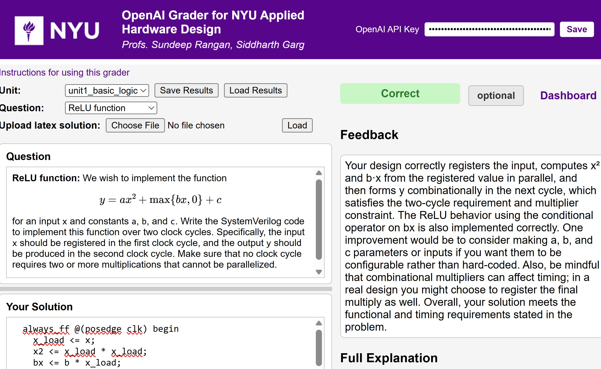

# LLM Grader Documentation

Welcome to the documentation for LLM Grader, a lightweight Flask-based tool for autograding engineering problems with LLMs.

## Key Features

LLM Grader is an open-source, early‑stage, research‑driven tool. The current version focuses on a small but functional core. The system already supports:

- Structured capture of instructor problems, reference solutions, and grading notes across engineering domains *(grading quality naturally depends on the model’s familiarity with the topic)*
- LLM‑based verification of student solutions using OpenAI models
- Flexible customization of grading schemes and scoring logic
- One‑click export of student submissions to Gradescope, along with a standalone Gradescope autograder

## People
The tool is being developed by [Sundeep Rangan](https://wireless.engineering.nyu.edu/sundeep-rangan/).  Sundeep is a
Professor in ECE at NYU and Director of NYU Wireless, a
research institute in next-generation wireless systems.

## Try it Out!

We are currently piloting the tool in [Introduction to Hardware Design](https://sdrangan.github.io/hwdesign/docs/), an entry‑level MS course at NYU for students with no prior hardware experience.  
Feel free to explore the grader yourself and let us know what you think — both positive and negative feedback are welcome.
  